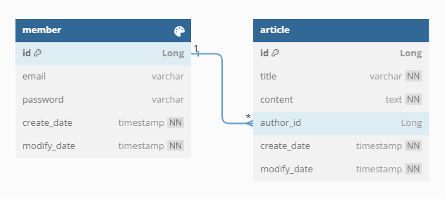

# wanted-pre-onboarding-backend 사전과제

---

### 지원자
박진영

### 애플리케이션 실행 방법

### 데이터베이스 테이블 구조

### 구현한 API의 동작을 촬영한 데모 영상 링크

### 구현 방법 및 이유에 대한 간략한 설명
도메인별 응집도를 높이기 위해 도메인형 패키지 구조를 선택했습니다

### API 명세(request/response 포함)
